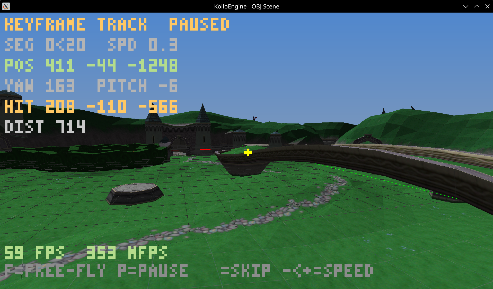
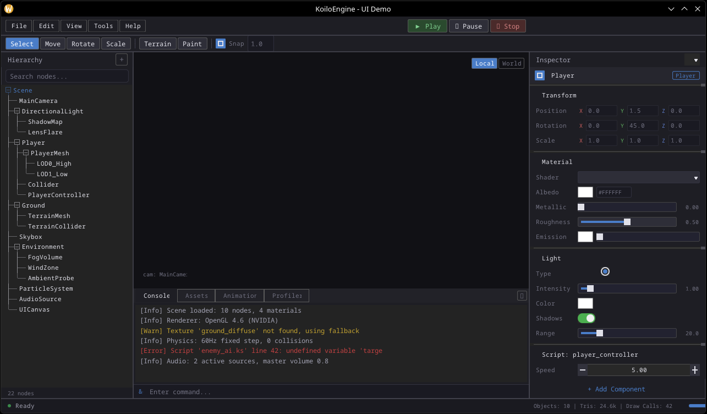
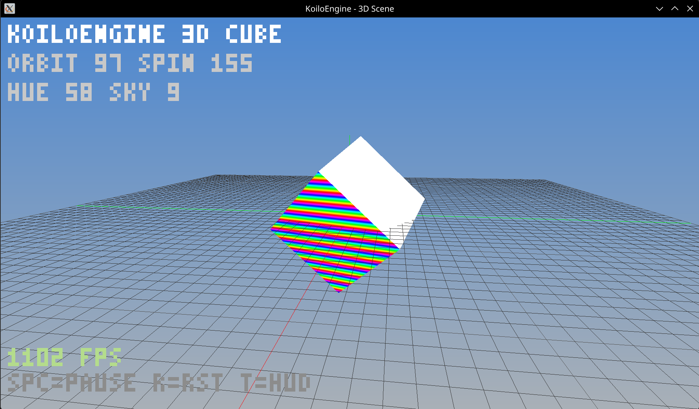
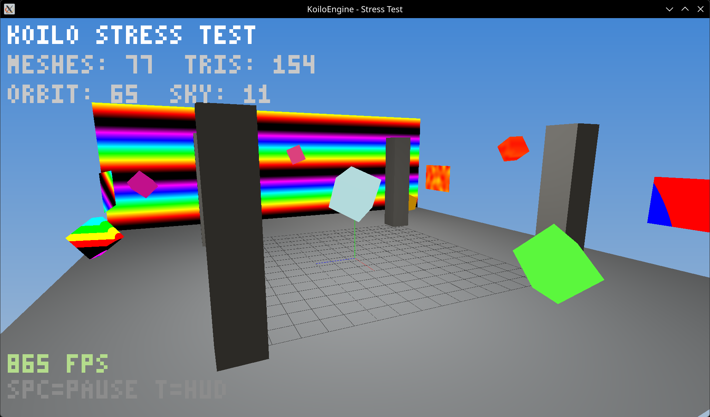
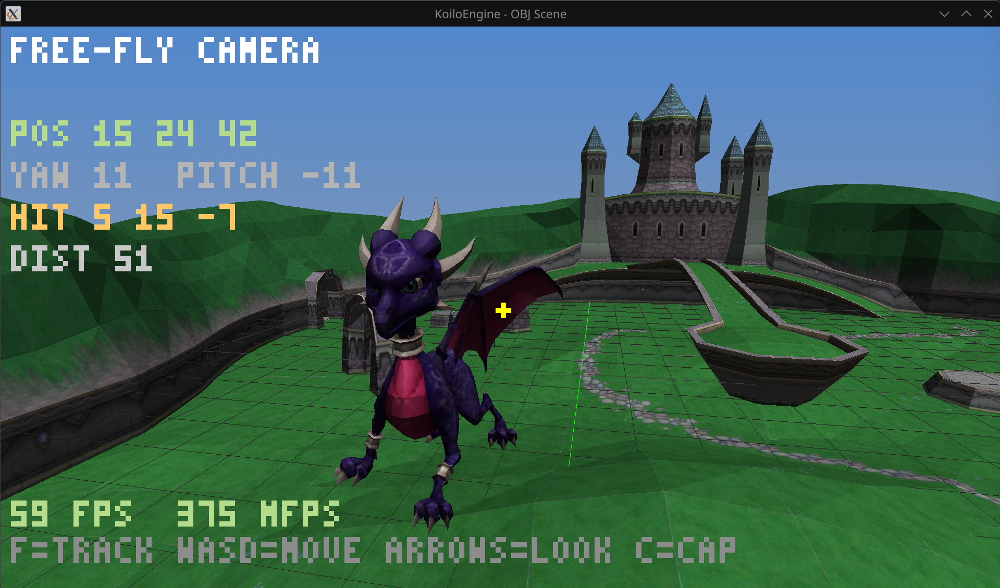
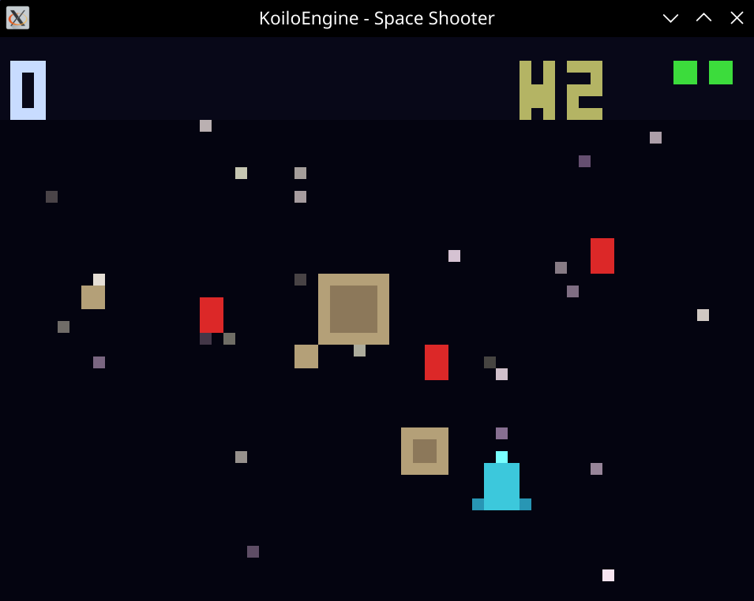
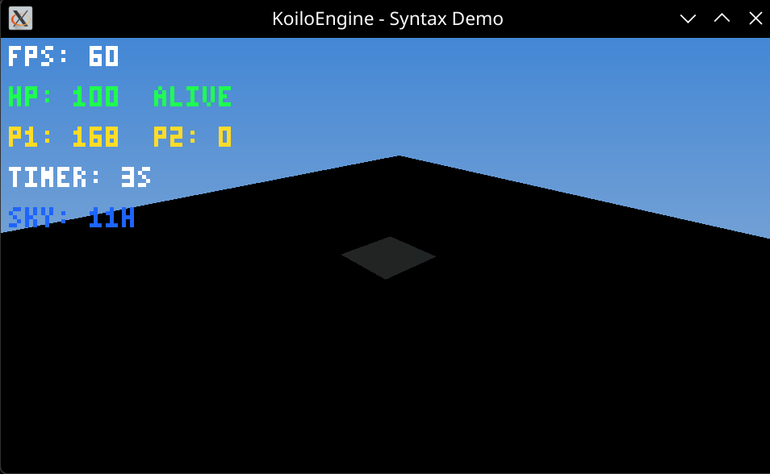
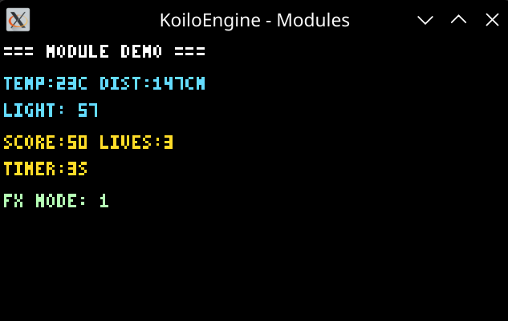

# Koilo Engine

[](https://github.com/coelacant1/Koilo-Engine/actions/workflows/ci.yml)

C++17 game engine for desktop and embedded platforms. Scenes and game logic are written in KoiloScript (`.ks`), a bytecode-compiled scripting language with full access to engine internals through runtime reflection.

**Platforms**: Linux, Windows, Raspberry Pi, Teensy 4.x, ESP32-S3, STM32

**License**: GPL-3.0-or-later




> [!WARNING]
> Heavily heavily work-in-progress. The API is not yet stable and the scripting engine has known limitations. I will be changing things without consideration to make sure the first release is built correctly.

## Features

- **Rendering** - Vulkan, OpenGL 3.3, and software rasterizer behind a common interface. KSL shaders compile to both GLSL and CPU from the same source.
- **Scripting** - KoiloScript: variables, functions, classes, coroutines, signals, imports, operator overloading. Scripts call C++ objects directly through the reflection bridge.
- **Reflection** - Expose C++ classes to scripts with `KL_BEGIN_DESCRIBE` macros. No external codegen.
- **Modules** - Dynamic `.so`/`.dll` modules with hot-reload, lifecycle hooks, and phased init order.
- **Scene Graph & ECS** - Spatial hierarchy with transform propagation and dense component storage.
- **Animation** - Skeleton playback, keyframe camera tracks, morph target blending, material animation.
- **Math** - Vectors, quaternions, matrices, transforms, geometric primitives, splines, spatial indexing, noise, Kalman filters, FFT.
- **Assets** - KoiloMesh format with morph targets. OBJ/FBX conversion via offline tools.

## Building

```bash
./build.sh

# Or manually
cmake -S . -B build -G Ninja
cmake --build build -j$(nproc)

# Run tests
./build/koilo_tests
./build/koilo_script_language_tests
```

| Build Option | Default | Description |
|---|---|---|
| `KOILO_USE_VULKAN` | ON | Vulkan rendering backend |
| `KOILO_USE_OPENGL` | ON | OpenGL 3.3 rendering backend |
| `KOILO_ENABLE_AI` | ON | Pathfinding, behavior trees, FSM |
| `KOILO_ENABLE_AUDIO` | ON | SDL2 audio backend |
| `KOILO_ENABLE_PARTICLES` | ON | Particle system |
| `KOILO_ENABLE_LED_VOLUME` | OFF | LED panel output pipeline |
| `KOILO_ENABLE_LIVE_PREVIEW` | OFF | HTTP live preview server |

## KoiloScript

```
DISPLAY { width: 800, height: 600 }

var scene = Scene()
var cam = Camera()
cam.SetPerspective(60.0, 0.1, 100.0)

fn Update(dt) {
    var t = scene.GetTime()
    cam.SetPosition(sin(t) * 5.0, 2.0, cos(t) * 5.0)
    cam.SetTarget(0.0, 0.0, 0.0)
    scene.Render(cam)
}
```

See `docs/scripting/koilo_script_spec.md` for the language specification.

## Examples

| Example | Description |
|---|---|
| `scene_3d` | 3D scene with KSL materials and orbiting camera |
| `space_shooter` | 2D shooter with signals, coroutines, collision, wave spawning |
| `stress_test` | Multi-mesh rendering with GPU vs software comparison |
| `obj_scene` | OBJ model loading with textures and keyframe camera |
| `syntax_demo` | KoiloScript language feature showcase |
| `module_demo` | Dynamic module loading with runtime reflection |
| `led_demo` | LED volume output to HUB75 panels |








## Contributing

See [CONTRIBUTING.md](CONTRIBUTING.md).
